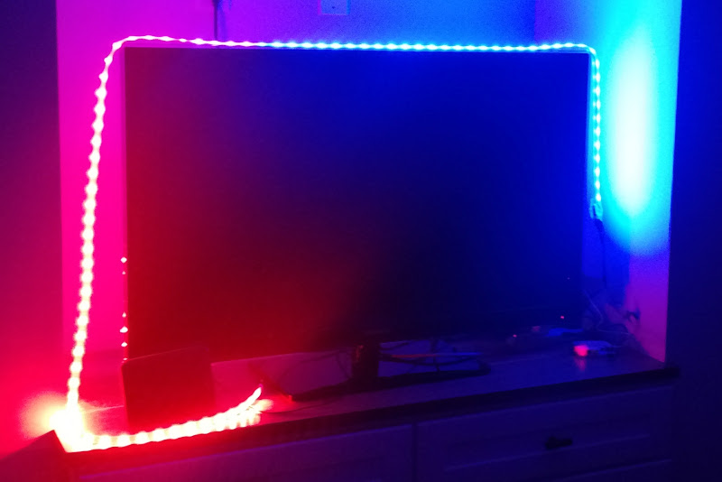

ElectorLights
=============

Use Adafruit NeoPixels and a RaspberryPi to display the current Electoral College results.

## Get the Code

Clone or download this project at [Github](https://github.com/davidbradway/ElectorLights).

## Images of ElectorLights in action

  Before any states were called.

  After the election was decided.

## Acknowledgement and Hardware Setup

Thanks to Tony DiCola's Python wrapper for the the excellent rpi_ws281x library created by Jeremy Garff, I can control the NeoPixels on the Raspberry Pi.

[Follow the Adafruit guide here to get your NeoPixels working with Raspberry Pi](https://learn.adafruit.com/neopixels-on-raspberry-pi/overview)

## Installation, with some of the Requirements listed
    ./install.sh

## Test Library
    sudo python rpi_ws281x/python/examples/strandtest.py

## Test the feed
    python test_feed.py

## Usage
    sudo python electorlights.py

## (Optional) To remove the script from start-up, run the following command:
    sudo update-rc.d -f electorlights.sh remove

## (Optional) commands for service
    sudo /etc/init.d/electorlights.sh start
    sudo /etc/init.d/electorlights.sh status
    sudo /etc/init.d/electorlights.sh stop

## (Optional) Crontab with logging
    * * * * * /bin/bash /home/pi/repos/ElectorLights/autorestart.sh >> /home/pi/myscript.log 2>&1

## (Optional) check the cron log
    grep CRON /var/log/syslog

## (Optional) or continuously monitor it
    tail -f /var/log/syslog | grep CRON
